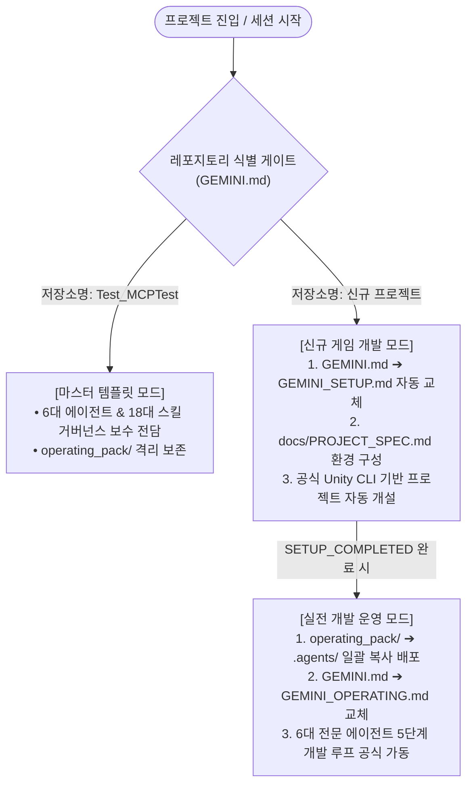
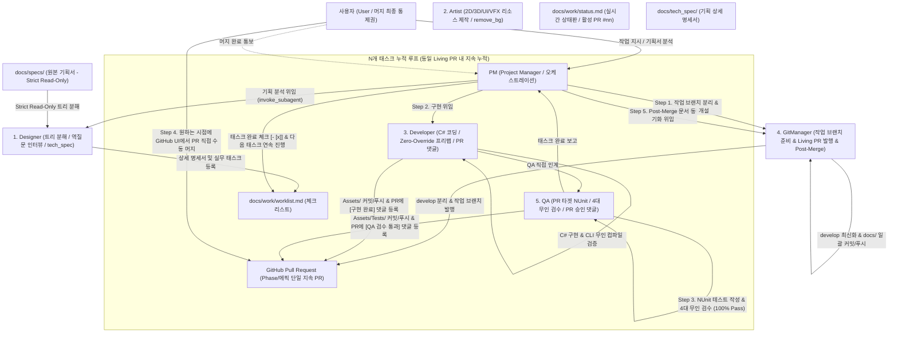
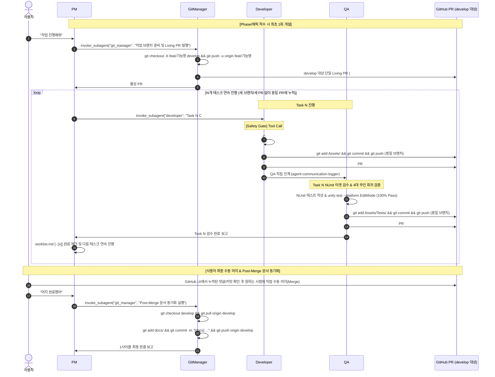

# Unity 6대 전문 에이전트 자율 협업 프레임워크 (Unity Multi-Agent Framework)

> **Antigravity AI 기반 6대 정예 에이전트 분업, 18대 전담 스킬 및 단일 거버넌스 헌장 시스템**
> 기획 분석부터 AI 리소스 제작, C# 클라이언트 개발, 2-Tier 무인 QA 검증, Clean PR 발행, Git 버전 관리 및 Notion 일지 기록까지 완전 자동화된 표준 개발 라이프사이클을 제공하는 유니티 프로젝트 전용 프레임워크입니다.

---

## 0. 거버넌스 헌장 체계 및 저장소 식별 게이트 (Charter & Gate Architecture)

본 프레임워크는 마스터 템플릿과 신규 게임 개발 프로젝트를 단일 저장소 구조에서 완벽히 분기 및 관리하는 **3대 헌장 라이프사이클**로 운영됩니다:



- **[`GEMINI.md`](GEMINI.md) (최상위 게이트 - GEMINI_FIRST)**: 저장소 명칭을 자동 감지하여 마스터 템플릿 모드 또는 신규 프로젝트 셋업 모드로 즉시 분기
- **[`GEMINI_SETUP.md`](.agents/templates/GEMINI_SETUP.md)**: 초기 환경 명세(`docs/PROJECT_SPEC.md`), 공식 Unity CLI 프로젝트 개설 및 기획서 등록 전담
- **[`GEMINI_OPERATING.md`](.agents/templates/GEMINI_OPERATING.md)**: 셋업 완료 후 운영 에셋 자동 배포(`operating_pack/` ➔ `.agents/`) 및 6대 에이전트 정규 개발 라이프사이클 가동

---

## 1. 6대 에이전트 협업 및 라이프사이클 흐름도 (Overall Architecture)



---

## 2. 단일 지속 PR 표준 개발 시퀀스 (Ongoing Living PR Sequence)

1개의 Phase/에픽 개발 작업은 `작업 브랜치 분리 ➔ 단일 지속 PR 개설 ➔ N개 태스크 연속 커밋/댓글 누적 ➔ 사용자 최종 1회 수동 머지 ➔ Post-Merge 문서 동기화`를 거쳐 진행됩니다:



---

## 3. 에이전트 4대 공통 행동 제어 및 안전 헌장 (Always-On Safety)

모든 에이전트는 아래의 4대 거버넌스 규칙을 무조건 준수합니다:

1. **도구 우회 사용 전면 금지 (Strict Tool Discipline)**:
   - 파일 수정/생성은 오직 네이티브 도구(`write_to_file`, `replace_file_content`)만, 터미널 실행은 `run_command`만 사용합니다.
   - `unityMCP`(`apply_text_edits`, `manage_script`, `execute_code` 등)를 악용한 임의 코드 조작 및 터미널 우회 프로세스 실행을 엄격히 금지합니다.
2. **직무 영역 준수 및 권한 부재 시 즉시 반려 (Strict Role Boundaries & Fast-Fail)**:
   - 각 에이전트는 본인의 화이트리스트 직무 영역(`Core Scope`)만 수행합니다.
   - 필요 도구 부재나 직무 외 지시 시 절대로 타 도구로 우회하지 않고 **즉시 0-Tool-Call로 작업을 중단하고 반려 사유를 보고**합니다. (QA는 비즈니스 로직 수정 절대 금지 ➔ 결함 시 즉시 QA 반려 5-C).
3. **단일 작업 100-Step 초과 방지 회로 차단 (Loop Circuit Breaker)**:
   - 단일 턴에서 도구 호출/스텝 수가 100회를 초과할 경우 무한 수정 루프를 즉시 차단(Circuit Break)하고 진행 상황 및 차단 사유를 명시하여 보고 후 대기합니다.
4. **서브 에이전트 실물 도구 호출 위임 의무화 (Mandatory Subagent Invocation)**:
   - PM은 직접 코드를 작성하거나 1인 다역(Roleplay)으로 실무를 하지 않고, 반드시 `invoke_subagent` 도구를 실제로 호출하여 독립된 전문 에이전트에게 실행을 위임합니다.

---

## 4. 토큰 최적화 및 2중화 파이프라인 (Token Diet & Dual-Pipeline)

### 1) 상태 기반 스마트 동적 프록시 ([`tools/mcp_filter_proxy.js`](tools/mcp_filter_proxy.js))
유니티 에디터가 제공하는 48종 도구 스키마(매 턴 10,000 토큰)를 그대로 로드하지 않고, `docs/work/status.md`의 현재 작업 단계에 맞추어 **실시간으로 필요한 도구(0~6종)만 동적으로 선별 노출**합니다.

```
[Antigravity 요청: tools/list] ──> [tools/mcp_filter_proxy.js (포트 8081)] ──> docs/work/status.md 분석
                                              │
    ┌──────────────────────┬──────────────────┴──────────────────┬──────────────────────┐
    ▼                      ▼                                     ▼                      ▼
[Developer] 단계       [QA] 검수 단계                        [Artist] 단계          [기획/Git/PM] 단계
• 콘솔/프리팹 5종 노출   • 콘솔/NUnit/카메라 6종 노출          • 카메라/프리팹 2종 노출  • 0종 노출 (0 토큰!)
(800 토큰 / 92% 절감)  (900 토큰 / 91% 절감)                 (300 토큰 / 97% 절감)   (100% 완전 절감)
```

- **실행 방법**: `node tools/mcp_filter_proxy.js` 가동 후 `mcp_config.json` 포트를 `8081`로 지정
- **안전 방화벽**: `execute_code`, `apply_text_edits` 등 헌장 위반 도구 6종은 프록시 단에서 원천 차단

### 2) 검증 2중화 파이프라인 (Dual-Pipeline Hierarchy)
- **1순위 (Unity MCP 최우선)**: 유니티 에디터가 실행 중일 때는 에디터 콘솔 에러 조회(`read_console`), 씬 인스펙션(`find_gameobjects`), 스크린샷 캡처를 최우선으로 활용합니다.
- **2순위 (Unity CLI 무인 자동 대체)**: 에디터 미기동/MCP 미연결 시 작업을 멈추지 않고 공식 Unity CLI([`unity-cli-runner`](.agents/templates/operating_pack/skills/unity-cli-runner/SKILL.md))로 백그라운드 무인 컴파일 검증(`unity run . -- -quit -batchmode`) 및 NUnit 무인 테스트(`unity test --platform EditMode`)로 자동 대체합니다.

---

## 5. 6대 전문 에이전트 R&R 매트릭스

| 에이전트 | 전담 직무 라인 (`Core Scope`) | 주요 전담 스킬 (HOW) | 핵심 산출물 및 검증 게이트 |
| :--- | :--- | :--- | :--- |
| **`PM`** | • 작업 라우팅 & 브랜치 지정<br>• `invoke_subagent` 실물 위임<br>• 물리적 상태 교차 검증<br>• FSM 루프 카운터 제어<br>• Post-Merge 문서 동기화 총괄 | `unity-pm-orchestration`<br>`github-issue-sync`<br>`unity-devlog-workflow` | • 종합 완료 보고서<br>• Notion 학습일지<br>• Double-Check Gate |
| **`Designer`** | • 원본 기획서(`docs/specs/`) 5대 갭 스캔<br>• 트리형 기능 분해 (Root ➔ Branch ➔ Leaf)<br>• 대화형 역질문 인터뷰 (A/B/C 객관식)<br>• 텔레포트 이벤트 청사진(`tech_spec/`)<br>• 4단계 실무 태스크 1:1 직렬화 도출 | `unity-design-workflow` | • `docs/tech_spec/`<br>• `docs/work/worklist.md`<br>• Strict Read-Only Gate<br>• Leaf-Node Convergence Gate |
| **`Artist`** | • 2D/3D 그래픽, UI, 오디오 제작<br>• `tools/remove_bg.py` 외곽 투명화<br>• `Assets/_Imports/` 표준 폴더 배치<br>• Particle System 완제품 프리팹 조립<br>• Animator Controller 상태 머신 구성 | `unity-art-asset-workflow`<br>`unity-vfx-anim-workflow` | • `Assets/_Imports/`<br>• `Assets/Prefabs/VFX/PF_VFX_*`<br>• `Assets/Animations/AC_*`<br>• Zero-Scene-VFX Gate |
| **`Developer`** | • C# 로직 신규 구현 & 수정/리팩토링<br>• .meta GUID 보존 In-place 수정<br>• Zero-Override 완제품 프리팹 조립<br>• 컴파일 0 에러/0 경고 2중 검증<br>• `Assets/` 선별 커밋 & 원격 즉시 푸시<br>• Living PR 구현 댓글 등록 & QA 직접 인계 | `unity-dev-workflow`<br>`unity-modify-workflow`<br>`unity-cli-runner`<br>`unity-coding-rule`<br>`unity-work-rule` | • `Assets/Scripts/`<br>• `Assets/Prefabs/PF_*`<br>• `docs/implementations/`<br>• First-Tool-Call Safety Gate<br>• Clean Commit Gate |
| **`QA`** | • PR 타겟 NUnit 테스트 작성 & 푸시<br>• 4대 런타임/정적 검수 (컴파일, CS0618, Zero-Override, Missing Ref)<br>• 무인 CLI 회귀 테스트 (100% Pass)<br>• Living PR 검수 승인 댓글 등록<br>• 종합 전수 검수 및 삼각 정합성 감사 | `unity-qa-workflow`<br>`unity-cli-runner`<br>`unity-qa-full-inspect`<br>`unity-spec-audit` | • `Assets/Tests/`<br>• Living PR 통과 댓글<br>• Fast-Fail & Zero-Fix Gate<br>• 100% Pass Approve Gate |
| **`GitManager`** | • develop 기준 로컬 작업 브랜치 분리/발행<br>• develop 대상 단일 지속 PR(Living PR) 발행<br>• 사용자 머지 후 Post-Merge 문서 동기화<br>• GitHub Issue 4단계 상태 전이 관리 | `git-branch-setup`<br>`git-pr-workflow`<br>`git-doc-sync`<br>`github-issue-sync` | • 작업 브랜치 원격 발행<br>• Living PR 관리<br>• Post-Merge `docs/` 동기화<br>• Clean PR Inspection Gate |

---

## 6. 유니티 프로젝트 표준 폴더 구조 색인 ([docs/FOLDER_STRUCTURE.md](docs/FOLDER_STRUCTURE.md))

```text
Assets/
├── _Imports/               # [Git Submodule 대상] 외부 원본 리소스 (Audio, Fonts, Models, Textures)
├── Animations/             # 유니티 애니메이션 클립(Anim_*), 컨트롤러(AC_*)
├── Materials/              # 유니티 머티리얼(M_*)
├── Prefabs/                # 유니티 완제품 프리팹(PF_*) (Characters/, Items/, VFX/, UI/)
├── Scenes/                 # 씬 파일(*Scene.unity, Stage[X]-[Y].unity)
├── ScriptableObjects/      # ScriptableObject 인스턴스 에셋(SO_*)
├── Scripts/                # C# 스크립트 (Core/, Systems/, Gameplay/, UI/, Utils/)
├── Sprites/                # 유니티 스프라이트 에셋(SP_*)
├── Tests/                  # NUnit 테스트 코드 (*Tests.cs)
│   ├── Editor/             # EditMode 단위 테스트 (수식, 로직, SO 검증)
│   └── Runtime/            # PlayMode 통합 테스트 (물리, 충돌, 스폰 풀링 검증)
└── Screenshots/            # QA 검수 캡처 스크린샷
```

---

## 7. 사용자 작업 실행 및 상태 진단 명령어 레퍼런스

| 명령어 구분 | 사용자 입력 예시 | 에이전트 동작 및 처리 결과 |
| :--- | :--- | :--- |
| **공식 상태 진단** | `"현재 상태는?"`, `"상태 확인"`, `"status"` | 헌장 및 파이프라인 5단계(작업 브랜치, PR 번호, 진행 태스크, 담당 에이전트) 진단 보고 |
| **단일 작업** | *"작업 하나 진행해줘"*, *"다음 작업 진행해줘"* | `worklist.md` 최우선 미완료 태스크 1개 착수 ➔ C# 구현 ➔ QA 검수 ➔ Living PR 댓글 누적 완결 |
| **배치 작업** | *"3개의 작업 진행해줘"*, *"N개의 작업 진행해줘"* | FSM 루프 카운터를 N으로 초기화하고 동일 Living PR 내에서 N개 태스크 연속 무인 완수 |
| **일괄 지정** | *"[키워드] 작업들 진행해줘"* | 키워드 일치 태스크 목록 확인 ➔ 사용자 승인 후 연속 완수 |
| **이슈 동기화** | *"이슈 체크해줘"*, *"이슈 확인해줘"* | [반려] Close, [수락]➔[착수] worklist 등록, [완료] Close, [제안] 대기건수 보고 |
| **전체 전수 검수** | *"전체 검수해줘"*, *"릴리즈 검수해줘"* | QA가 전체 스크립트/씬/프리팹 Zero-Override/테스트 통계 종합 보고서 발행 |
| **정합성 감사** | *"기획/코드/문서 검수해줘"*, *"감사해줘"* | QA가 기획(tech_spec) ➔ 코드 ➔ 구현문서 ➔ 관계도 삼각 정합성 정밀 감사 |
| **일일 마감** | *"오늘 작업 마칠게"*, *"개발일지 작성해줘"*, *"퇴근"* | 이슈 상태 최종 점검 ➔ Notion `학습일지` DB에 자동 일지 및 토글 피드백 생성 |
