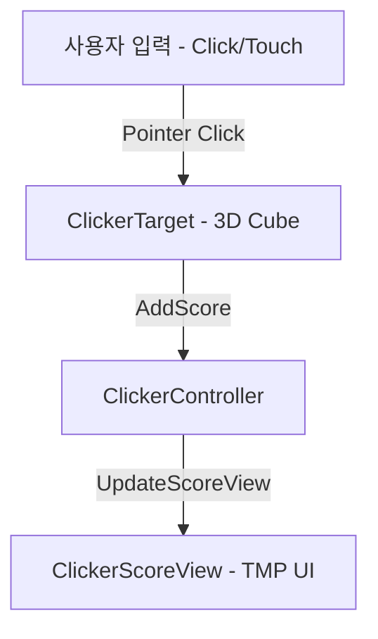
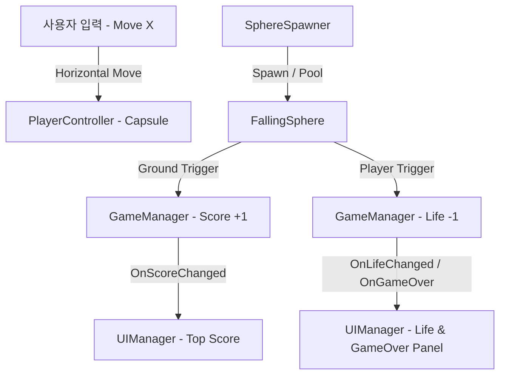

# TestMCP 프로젝트 마스터 색인 (Master Index)

## 1. 개요
TestMCP 프로젝트의 시스템 설계, 기획 스펙, 담당 씬 및 통합 참조 문서 색인입니다.

---

## 2. 기획 및 기능 명세서 목록 (Feature Specs)

| 기능명 | 담당 씬 | 스펙 문서 | 상태 | 비고 |
| :--- | :--- | :--- | :--- | :--- |
| **클리커 게임 테스트** | `Assets/Scenes/ClickerScene.unity` | [`docs/specs/clicker_test.md`](./specs/clicker_test.md) | 개발 중 | 세로형(9:16) 화면, 중앙 큐브 클릭 시 상단 UI 카운트 1 증가 |
| **낙하 회피 게임** | `Assets/Scenes/DodgeGameScene.unity` | [`docs/specs/falling_dodge_game.md`](./specs/falling_dodge_game.md) | 구현 완료 | 가로형(16:9) 화면, 낙하 구체 회피, 바닥 도달 시 득점, 초기 Life 5 |

---

## 3. 통합 아키텍처 개요

### 3.1 클리커 게임 흐름 (Clicker Game)

### 3.2 낙하 회피 게임 흐름 (Falling Dodge Game)

