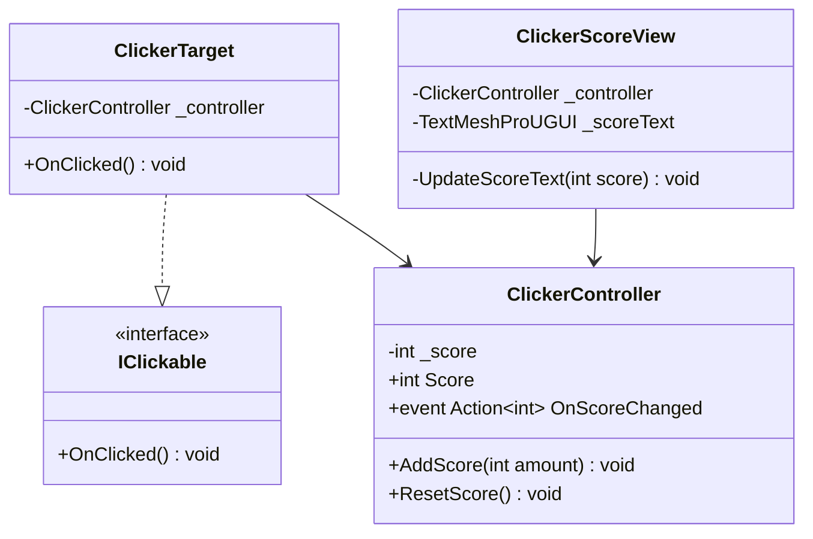

# 마스터 색인 (Master Index)

## 기능 목록
- [클리커 테스트](docs/specs/clicker_test.md)

## 시스템 통합 클래스 다이어그램

```mermaid
classDiagram
    class IClickable {
        <<interface>>
        +OnClicked() void
    }
    class ClickerController {
        -int _score
        +int Score
        +event Action~int~ OnScoreChanged
        +AddScore(int amount) void
        +ResetScore() void
    }
    class ClickerTarget {
        -ClickerController _controller
        +OnClicked() void
    }
    class ClickerScoreView {
        -ClickerController _controller
        -TextMeshProUGUI _scoreText
        -UpdateScoreText(int score) void
    }

    ClickerTarget ..|> IClickable
    ClickerTarget --> ClickerController
    ClickerScoreView --> ClickerController
```
