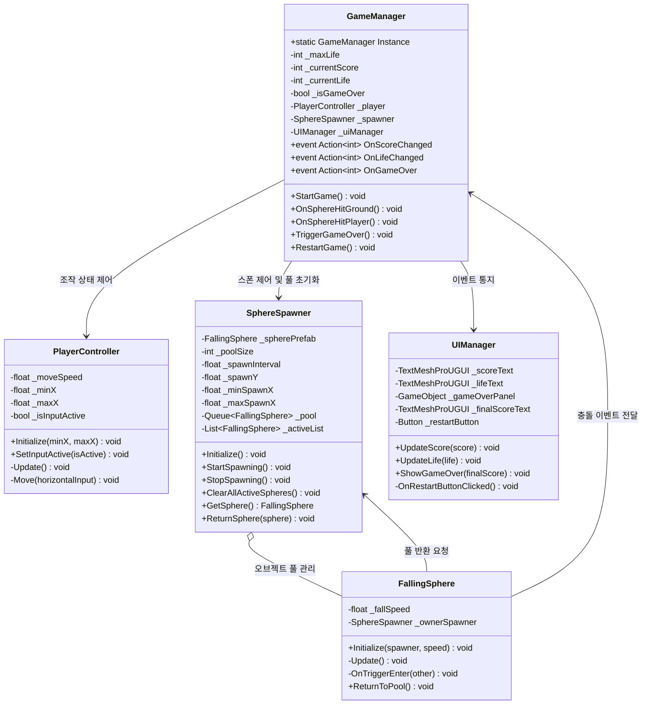
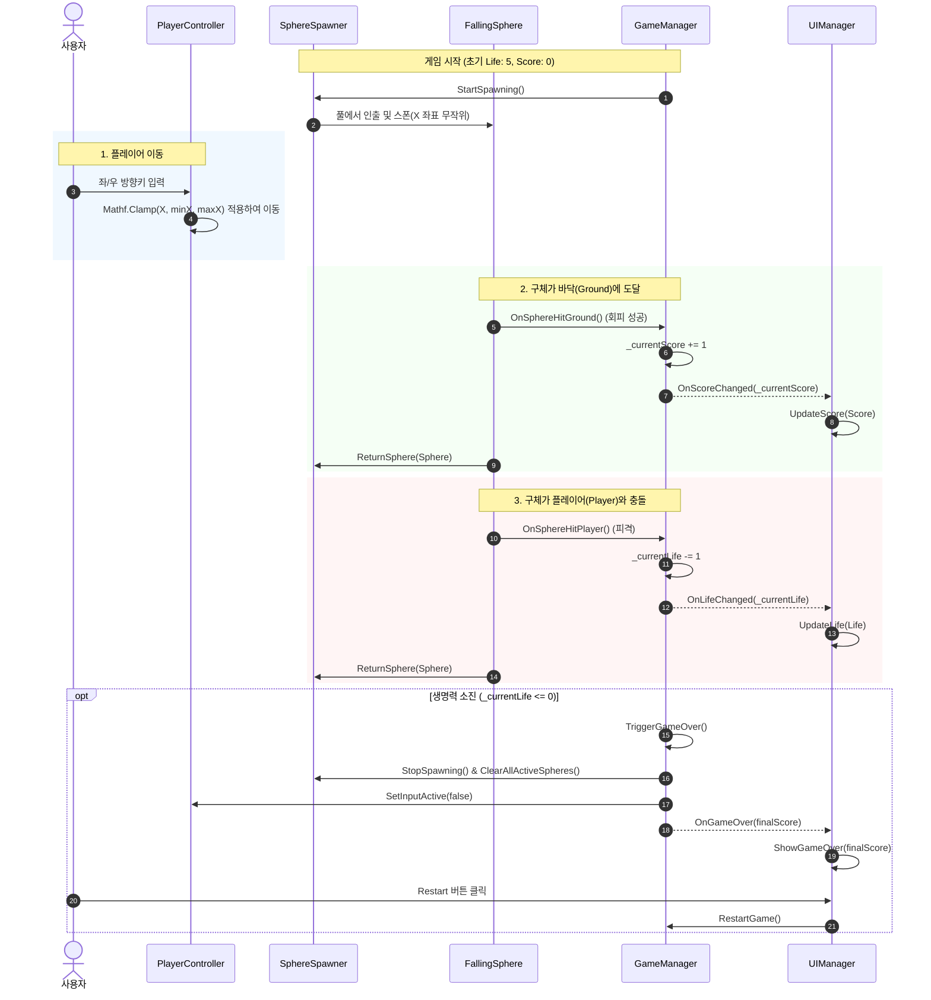
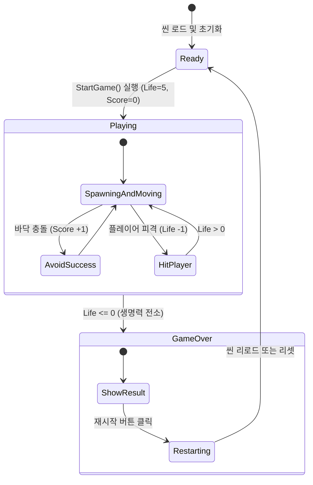

# 낙하 회피 게임 (Falling Dodge Game) 기능 명세서

## 1. 개요 및 씬 구성

### 1.1 개요
- **기능명**: 낙하 구체 회피 및 점수 획득 미니 게임 (Falling Dodge Game)
- **화면 해상도**: 가로형 16:9 고정 (1920 x 1080)
- **담당 씬**: `Assets/Scenes/DodgeGameScene.unity`
- **담당 네임스페이스**: `TestMCP.DodgeGame`
- **핵심 목표**: 상단에서 떨어지는 구체(Sphere)를 회피하면서, 구체가 바닥에 도달해 누적되는 점수를 최대화하고 생명력이 소진되기 전까지 생존하는 아케이드 미니 게임.

### 1.2 씬 구성 요소 (Scene Hierarchy)
- **Main Camera**: Orthographic 또는 Perspective (Z축 정면 뷰, 1920x1080 16:9 뷰포트 고정)
- **Directional Light**: 기본 조명 설정
- **Environment**:
  - `Ground`: 하단 바닥 콜라이더 (Sphere 도달 판정용 트리거)
  - `LeftBoundary` / `RightBoundary`: 좌우 이동 제한 물리/가상 경계 (X축 범위)
- **Player**:
  - 캡슐(Capsule) 3D 모델/콜라이더 (`CapsuleCollider`, `Rigidbody` Kinematic 또는 IsTrigger)
  - 컴포넌트: `PlayerController`
  - 태그: `Player`
- **Managers**:
  - `GameManager`: 점수, 라이프, 게임 상태 제어
  - `SphereSpawner`: 구체 스폰 및 오브젝트 풀 관리
  - `UIManager`: 점수, 생명력, 게임오버 팝업 연동
- **UI Canvas (1920 x 1080 Canvas Scaler - Scale With Screen Size)**:
  - `TopScorePanel`: 화면 상단 중앙 점수 표시 (TextMeshProUGUI)
  - `TopLeftLifePanel`: 화면 좌측 상단 생명력 표시 (초기값 5, TextMeshProUGUI 또는 하트 카운트)
  - `GameOverPanel`: 게임오버 시 노출되는 결과 패널 (최종 점수, 재시작 버튼)

---

## 2. 게임 규칙 및 세부 로직

### 2.1 플레이어 이동 및 경계 제한
- **입력 방식**: 좌/우 방향키, A/D 키, 또는 New Input System의 `Move` 액션(Vector2 수평축).
- **이동 축**: X축(좌우)으로만 이동하며 Y/Z축은 고정.
- **화면 이탈 방지**:
  - 16:9 해상도 기준 카메라 뷰포트(Viewport) 좌표 (0.05 ~ 0.95) 또는 고정 월드 좌표 제한값(`_minX`, `_maxX`) 내에서 `Mathf.Clamp` 적용.
  - 플레이어의 피벗과 캡슐 반경을 고려하여 화면 밖으로 완전히 벗어나지 않도록 클램핑.

### 2.2 구체 낙하 및 스폰 (Sphere Spawning & Falling)
- **스폰 위치**: 화면 상단(Y = 고정 상단 높이), X축은 유효 이동 범위(`_minSpawnX` ~ `_maxSpawnX`) 내 무작위.
- **스폰 간격**: 기본 0.8초 ~ 1.2초 주기로 지속 생성 (난이도에 따른 조절 가능).
- **낙하 방식**: Y축 음수 방향(-Y)으로 일정한 속도(`_fallSpeed`)로 하강 (Rigidbody Velocity 또는 Transform.Translate).
- **오브젝트 풀링**: 가비지 컬렉션(GC) 부하 최소화를 위해 `Queue<FallingSphere>` 기반 풀링 사용.

### 2.3 충돌 및 점수/생명력 판정
1. **Sphere <-> Ground (바닥 도달)**:
   - 구체가 플레이어에게 닿지 않고 하단 트리거에 도달한 경우.
   - 점수 +1 가산 (`GameManager.AddScore(1)`).
   - 화면 상단 점수 UI 갱신.
   - 구체는 비활성화 후 오브젝트 풀로 반환.
2. **Sphere <-> Player (플레이어 피격)**:
   - 구체가 플레이어 캡슐 콜라이더와 충돌한 경우.
   - 생명력 -1 차감 (`GameManager.TakeDamage(1)`).
   - 화면 좌측 상단 Life UI 갱신.
   - 구체는 비활성화 후 오브젝트 풀로 반환.
   - 피격 시 플레이어 시각 피드백(깜빡임 효과 등) 제공 가능.

### 2.4 게임오버 및 재시작 흐름
- **초기 생명력**: 5 (Life = 5).
- **종료 조건**: 생명력이 0 이하(`_currentLife <= 0`)가 되면 즉시 게임오버 상태로 전환.
- **게임오버 처리**:
  1. `SphereSpawner.StopSpawning()` 및 활성 구체 전체 비활성화/풀 회수.
  2. `PlayerController.SetInputActive(false)`로 플레이어 조작 비활성화.
  3. `UIManager.ShowGameOver(finalScore)` 호출하여 게임오버 UI 활성화.
  4. 재시작(Restart) 버튼 클릭 시 씬 리로드(`SceneManager.LoadScene`) 또는 게임 상태 리셋(`GameManager.RestartGame()`).

---

## 3. 클래스 및 참조 맵 (Class & Reference Map)

### 3.1 PlayerController (컴포넌트)
- **네임스페이스**: `TestMCP.DodgeGame`
- **상속**: `MonoBehaviour`
- **역할**: 사용자 입력을 받아 플레이어 캡슐의 좌우 이동 처리 및 화면 경계 클램핑.
- **필드**:
  - `[SerializeField] private float _moveSpeed = 8f;` : 좌우 이동 속도
  - `[SerializeField] private float _minX = -8.0f;` : 이동 가능 최소 X 좌표
  - `[SerializeField] private float _maxX = 8.0f;` : 이동 가능 최대 X 좌표
  - `private bool _isInputActive = true;` : 입력 활성화 플래그
- **메서드**:
  - `public void Initialize(float minX, float maxX)`: 경계값 초기화
  - `public void SetInputActive(bool isActive)`: 입력 가능 여부 설정
  - `private void Update()`: New Input System / 수평 축 입력 수신 및 이동 연산
  - `private void Move(float horizontalInput)`: 위치 갱신 및 `Mathf.Clamp` 적용

### 3.2 FallingSphere (컴포넌트)
- **네임스페이스**: `TestMCP.DodgeGame`
- **상속**: `MonoBehaviour`
- **역할**: 상단에서 하단으로 낙하하며 플레이어/바닥과의 충돌 감지 및 이벤트 트리거.
- **필드**:
  - `[SerializeField] private float _fallSpeed = 5f;` : 낙하 속도
  - `private SphereSpawner _ownerSpawner;` : 복귀할 풀 소유자 참조
- **메서드**:
  - `public void Initialize(SphereSpawner spawner, float speed)`: 초기화 및 속도 설정
  - `private void Update()`: `-Vector3.up * _fallSpeed * Time.deltaTime` 이동
  - `private void OnTriggerEnter(Collider other)`:
    - 태그 `Player` 감지 시: `GameManager.Instance.OnSphereHitPlayer()`, 풀 반환
    - 태그 `Ground` 감지 시: `GameManager.Instance.OnSphereHitGround()`, 풀 반환
  - `public void ReturnToPool()`: `_ownerSpawner.ReturnSphere(this)` 호출

### 3.3 SphereSpawner (컴포넌트)
- **네임스페이스**: `TestMCP.DodgeGame`
- **상속**: `MonoBehaviour`
- **역할**: 구체 오브젝트 풀 관리 및 일정 주기마다 무작위 X 위치에 구체 스폰.
- **필드**:
  - `[SerializeField] private FallingSphere _spherePrefab;` : 구체 원본 프리팹
  - `[SerializeField] private int _poolSize = 20;` : 초기 풀 생성 개수
  - `[SerializeField] private float _spawnInterval = 1.0f;` : 스폰 주기
  - `[SerializeField] private float _spawnY = 6.0f;` : 스폰 Y 좌표
  - `[SerializeField] private float _minSpawnX = -7.5f;` : 스폰 최소 X
  - `[SerializeField] private float _maxSpawnX = 7.5f;` : 스폰 최대 X
  - `private Queue<FallingSphere> _pool;` : 비활성 풀
  - `private List<FallingSphere> _activeList;` : 현재 활성화된 구체 목록
  - `private Coroutine _spawnCoroutine;` : 스폰 코루틴 핸들
- **메서드**:
  - `public void Initialize()`: 풀 생성 및 초기화
  - `public void StartSpawning()`: 스폰 코루틴 구동
  - `public void StopSpawning()`: 스폰 코루틴 정지
  - `public void ClearAllActiveSpheres()`: 활성 구체 전체 비활성화 및 풀 회수
  - `public FallingSphere GetSphere()`: 풀에서 구체 인출
  - `public void ReturnSphere(FallingSphere sphere)`: 풀로 구체 반환
  - `private IEnumerator SpawnRoutine()`: 주기적 스폰 로직

### 3.4 GameManager (싱글톤 컴포넌트)
- **네임스페이스**: `TestMCP.DodgeGame`
- **상속**: `MonoBehaviour`
- **역할**: 게임 진행 상태, 점수, 생명력 데이터 총괄 관리 및 이벤트 브로드캐스팅.
- **필드**:
  - `public static GameManager Instance { get; private set; }` : 싱글톤 인스턴스
  - `[SerializeField] private int _maxLife = 5;` : 최대 생명력
  - `[SerializeField] private PlayerController _player;` : 플레이어 참조
  - `[SerializeField] private SphereSpawner _spawner;` : 스포너 참조
  - `[SerializeField] private UIManager _uiManager;` : UI 매니저 참조
  - `private int _currentScore;` : 현재 점수
  - `private int _currentLife;` : 현재 생명력
  - `private bool _isGameOver;` : 게임오버 여부
- **이벤트**:
  - `public event Action<int> OnScoreChanged;` : 점수 변경 알림
  - `public event Action<int> OnLifeChanged;` : 생명력 변경 알림
  - `public event Action<int> OnGameOver;` : 게임오버 알림 (최종 점수 전달)
- **메서드**:
  - `public void StartGame()`: 게임 초기화, 점수 0, 생명력 5 설정 및 스폰 시작
  - `public void OnSphereHitGround()`: `_currentScore++`, `OnScoreChanged?.Invoke(_currentScore)`
  - `public void OnSphereHitPlayer()`: `_currentLife--`, `OnLifeChanged?.Invoke(_currentLife)`, 0 이하 시 `TriggerGameOver()`
  - `private void TriggerGameOver()`: `_isGameOver = true`, 스포너 정지, 조작 정지, `OnGameOver?.Invoke(_currentScore)`
  - `public void RestartGame()`: 현재 씬 재로드 또는 상태 리셋

### 3.5 UIManager (컴포넌트)
- **네임스페이스**: `TestMCP.DodgeGame`
- **상속**: `MonoBehaviour`
- **역할**: 게임 내 UI 뷰(점수, 라이프, 게임오버 팝업) 갱신 및 버튼 이벤트 바인딩.
- **필드**:
  - `[SerializeField] private TextMeshProUGUI _scoreText;` : 화면 상단 점수 텍스트
  - `[SerializeField] private TextMeshProUGUI _lifeText;` : 화면 좌측 상단 생명력 텍스트
  - `[SerializeField] private GameObject _gameOverPanel;` : 게임오버 패널
  - `[SerializeField] private TextMeshProUGUI _finalScoreText;` : 게임오버 결과 점수 텍스트
  - `[SerializeField] private Button _restartButton;` : 재시작 버튼
- **메서드**:
  - `private void Awake()` / `private void OnEnable()`: `GameManager` 이벤트 구독
  - `public void UpdateScore(int score)`: 점수 텍스트 갱신 ("SCORE: {0}")
  - `public void UpdateLife(int life)`: 생명력 텍스트 갱신 ("LIFE: {0}")
  - `public void ShowGameOver(int finalScore)`: 패널 활성화 및 최종 점수 표시
  - `private void OnRestartButtonClicked()`: `GameManager.Instance.RestartGame()` 호출

---

## 4. 다이어그램 (Mermaid)

### 4.1 클래스 구조 다이어그램

### 4.2 게임 플레이 및 상호작용 시퀀스 다이어그램

### 4.3 게임 상태 전이(State Machine) 다이어그램

---

## 5. 세분화된 구현 태스크 목록 (Developer용)

| 태스크 ID | 작업 분류 | 작업 상세 내용 | 완료 조건 (DoD) |
| :--- | :--- | :--- | :--- |
| **TASK-DDG-01** | Scene & Prefabs | `Assets/Scenes/DodgeGameScene.unity` 씬 생성, Main Camera(16:9), Ground 트리거, 좌우 경계 배치 | 16:9 해상도에서 기본 씬 환경 정상 렌더링 |
| **TASK-DDG-02** | Prefabs | Player Capsule 프리팹 및 FallingSphere 프리팹 생성 (Collider, Material, Tag 설정) | Player, Sphere 프리팹의 콜라이더/태그 정상 등록 |
| **TASK-DDG-03** | Core / Player | `PlayerController.cs` 작성 (좌우 이동, 속도 제어, `Mathf.Clamp` 경계 제한 로직) | 방향키 입력 시 화면 밖을 벗어나지 않고 부드럽게 이동 |
| **TASK-DDG-04** | Core / Spawner | `FallingSphere.cs`, `SphereSpawner.cs` 구현 (오브젝트 풀링, 일정 주기 낙하 및 스폰) | 구체가 상단 랜덤 X 좌표에서 하단으로 등속 낙하 및 풀 회수 |
| **TASK-DDG-05** | Core / Game | `GameManager.cs` 구현 (점수, 생명력 5 관리, 피격/회피 처리, 게임오버 로직) | 충돌 시 점수 가산(+1) 및 라이프 차감(-1), 0 도달 시 게임오버 전환 |
| **TASK-DDG-06** | UI | `UIManager.cs` 작성, 상단 점수 UI, 좌측 상단 Life UI, GameOverPanel 및 재시작 연동 | 점수/라이프 실시간 UI 반영 및 재시작 버튼 정상 동작 |
| **TASK-DDG-07** | Integration | 씬 내 모든 컴포넌트 레퍼런스 연결 및 통합 플레이 테스트 | 콘솔 에러 없이 게임 플레이 루프 완결 |

---

## 6. QA 인수 검증 체크리스트

| 번호 | 검증 항목 | 검증 절차 및 기준 | 결과 판정 |
| :---: | :--- | :--- | :---: |
| **TC-01** | **해상도 및 경계 검증** | 1920x1080 (16:9) 화면에서 플레이어를 좌/우 끝까지 계속 이동시켰을 때 화면 밖으로 이탈하지 않고 경계선에 정확히 정지하는가 | Pass / Fail |
| **TC-02** | **입력 반응 검증** | 좌/우 방향키(또는 A/D) 입력 시 플레이어가 지정된 속도(`_moveSpeed`)로 지연 없이 즉각 반응하여 이동하는가 | Pass / Fail |
| **TC-03** | **구체 스폰 검증** | 상단 화면(지정 Y값) 내에서 무작위 X 좌표로 구체가 정해진 주기(`_spawnInterval`)마다 정상 낙하하는가 | Pass / Fail |
| **TC-04** | **회피 및 점수 획득 검증** | 구체가 플레이어와 닿지 않고 하단 바닥(Ground)에 충돌 시 상단 점수 UI가 정확히 +1 증가하고 구체가 풀로 반환되는가 | Pass / Fail |
| **TC-05** | **피격 및 생명력 감소 검증** | 구체가 플레이어 캡슐과 충돌 시 좌측 상단 Life UI가 1 감소하고(초기 5에서 4로), 구체가 즉시 사라지는가 | Pass / Fail |
| **TC-06** | **게임오버 조건 검증** | 피격이 5회 발생하여 Life가 0이 되었을 때 스폰이 즉시 중지되고, 플레이어 조작이 정지되며, GameOver 패널이 노출되는가 | Pass / Fail |
| **TC-07** | **재시작 검증** | GameOver 패널의 재시작(Restart) 버튼을 클릭했을 때 점수가 0, Life가 5로 초기화되어 새로운 게임이 정상 시작되는가 | Pass / Fail |
| **TC-08** | **메모리 및 예외 검증** | 장시간(3분 이상) 플레이 시 메모리 누수 없이 오브젝트 풀이 정상 재활용되며, 콘솔에 NullReferenceException / MissingReferenceException이 0건인가 | Pass / Fail |
