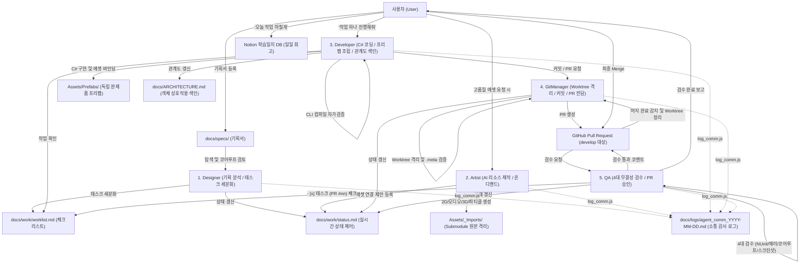
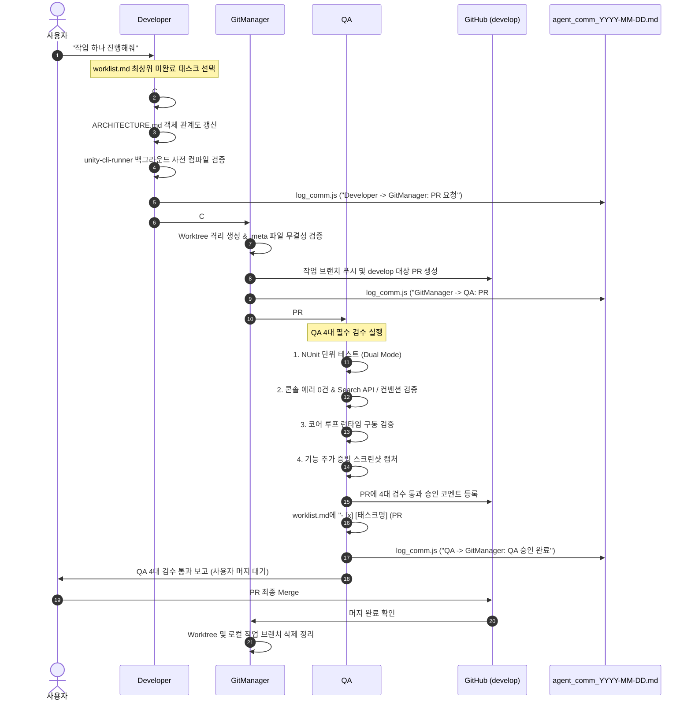
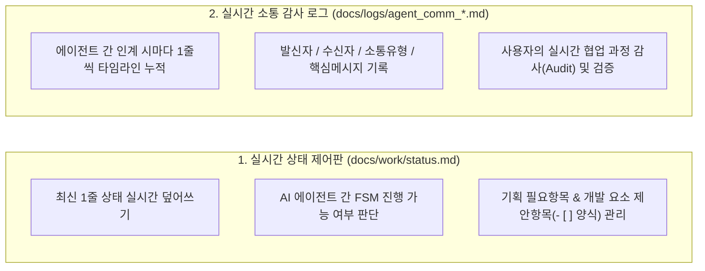
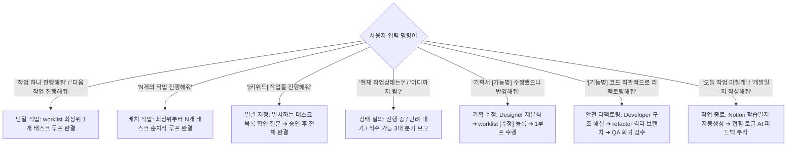

# 5대 전문 에이전트 시스템 구조 및 협업 관계도 (Agent Architecture & Workflow)

이 문서는 프로젝트 내 5대 정예 에이전트의 역할 분담, 1개 작업 완결 루프, 실시간 소통 및 이원화 관리 체계를 시각화한 마스터 아키텍처 다이어그램입니다.

---

## 1. 5대 에이전트 협업 및 라이프사이클 흐름도 (Overall Architecture)

---

## 2. 1개 작업 단위 완결 시퀀스 (Single Task Loop Sequence)

1개 작업(Task)은 `Developer ➔ GitManager ➔ QA`의 완전한 검수 및 승인 사이클을 마쳤을 때 완결됩니다:

---

## 3. 이원화 관리 체계 (Dual-Tracking System)

---

## 4. 5대 전문 에이전트 R&R 매트릭스

| 에이전트 | 단일 전담 역할 (Single Responsibility) | 주요 도구 및 규칙 | 핵심 산출물 |
| :--- | :--- | :--- | :--- |
| **`Designer`** | 기획서 정밀 분석, 코어루프 검토, 태스크 세분화 | `docs/specs/`, `GEMINI.md` | `worklist.md`, `status.md` |
| **`Artist`** | AI 2D/3D/오디오 리소스 생성, Particle System, Animator Controller | 나노바나나, UnityMCP, `asset_generation_rule.md` | `Assets/_Imports/`, `status.md` 제안 |
| **`Developer`** | C# 코딩, 프리미티브 더미 조립, Search API 금지/보류, CLI 사전검수 | `csharp_coding_rule.md`, `unity-cli-runner` | `PF_*.prefab`, `docs/ARCHITECTURE.md` |
| **`QA`** | NUnit 테스트, 콘솔/Search API 검증, 코어루프 검증, 스크린샷 캡처 | UnityMCP, `unity-cli-runner` | PR 승인 코멘트, `worklist.md [x] (PR #nn)` |
| **`GitManager`** | Git Worktree 격리, .meta 검증, 커밋/푸시, PR 생성 및 머지 정리 | `git_rule.md`, GitHub MCP | GitHub PR, 클린 저장소 |

---

## 5. 사용자 작업 실행 명령어 라우팅 맵

